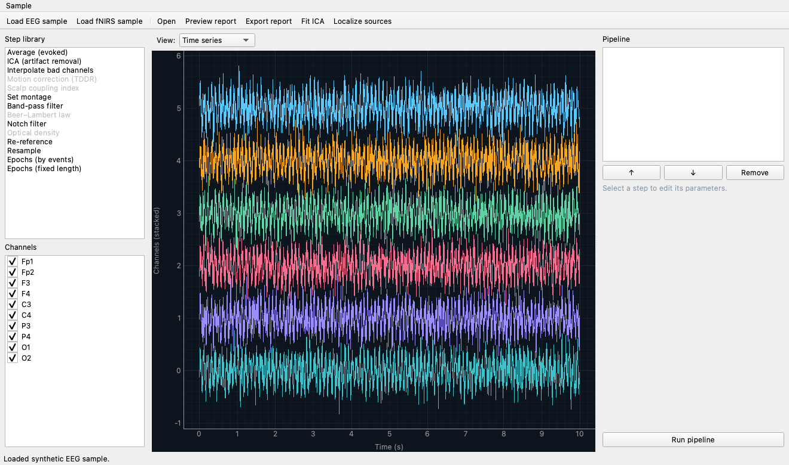
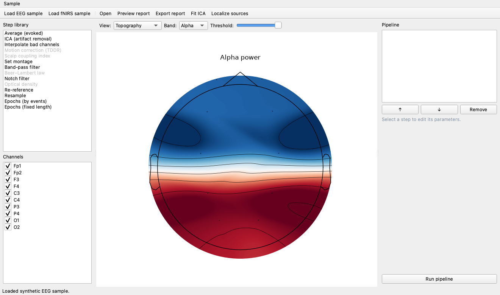
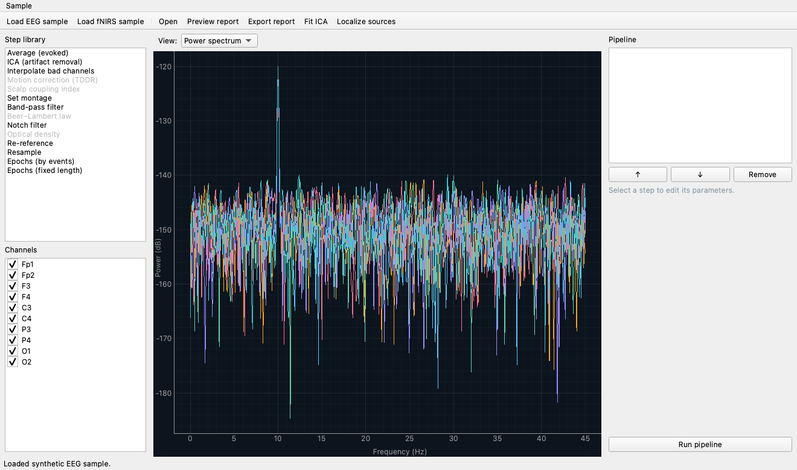
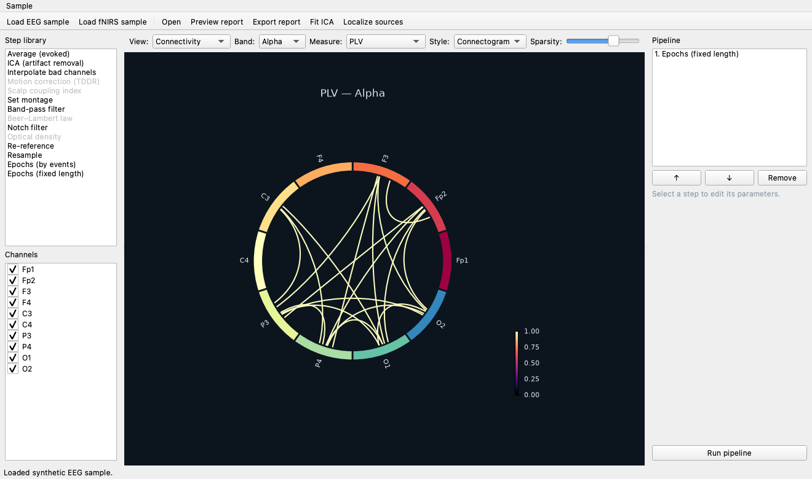
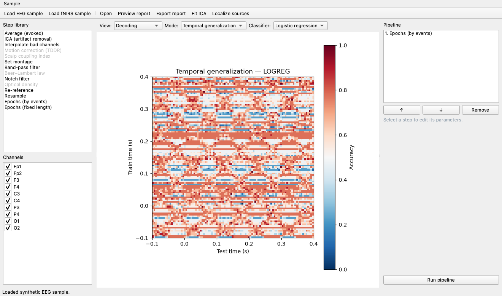

<h1 align="center">🧠 Cortica</h1>
<p align="center"><em>A guided, reproducible workbench for EEG &amp; fNIRS analysis.</em></p>

<p align="center">
  <a href="#project-status"></a>
  
  
  
  
</p>

Cortica is a cross-platform desktop app for analyzing **EEG and fNIRS** recordings.
Its one idea: **every action you take in the GUI is recorded as a step in a
re-runnable pipeline.** Reproducibility and a shareable report then come for free —
the same pipeline you built by clicking can be saved as a small YAML file, re-run
headless on new data, and rendered into a self-contained HTML report.

It is built on [MNE-Python](https://mne.tools) — the standard scientific engine for
both EEG and fNIRS — so Cortica focuses on the *workbench* (the guided UI, the
pipeline, the report) rather than reinventing the science underneath.

<p align="center">
  
</p>

> [!IMPORTANT]
> **Research use only.** Cortica is a tool for research neuroscientists. It is
> **not** a medical device and must not be used for clinical diagnosis or treatment.

---

## Table of contents

- [Why Cortica](#why-cortica)
- [What Cortica can do](#what-cortica-can-do)
- [Install](#install)
- [Quick start](#quick-start)
- [A tour of the window](#a-tour-of-the-window)
- [Analysis views](#analysis-views)
- [Gallery](#gallery)
- [Reproducible pipelines & the CLI](#reproducible-pipelines--the-cli)
- [Working with your own data](#working-with-your-own-data)
- [For developers](#for-developers)
- [Project status](#project-status)
- [License](#license)

---

## Why Cortica

Powerful toolkits already exist (MNE-Python, MNELAB, EEGLAB, Brainstorm). Cortica's
niche is the *combination*:

- **Unified EEG + fNIRS.** One coherent tool for both — including studies that record
  them together. Every step declares which modalities it supports, and the UI greys
  out steps that don't apply to the data you loaded (ICA is EEG-only; Beer–Lambert,
  scalp-coupling and TDDR are fNIRS-only).
- **Guided, but not rigid.** A natural workflow — import → signal check → preprocess
  → segment → analyze → report — that newcomers can follow and power users can step
  outside of.
- **Reproducible by construction.** The pipeline *is* the source of truth. Save it as
  YAML, re-run it headless, or hand it to a colleague. What you see is what you
  publish — there is no hidden manual step between your analysis and your report.
- **Free to install and share.** Pure pip/conda distribution, no paid signing
  certificates required.

---

## What Cortica can do

### Analysis steps (the pipeline building blocks)

Steps are the things that transform your data. They appear in the **Step library**
and, once added, become the ordered pipeline you can save and re-run.

| Category | Step | Modality | What it does |
|---|---|---|---|
| Import & setup | **Set montage** | EEG | Assign electrode 3-D positions by channel name (needed for head maps, interpolation, source localization) |
| Preprocess | **Band-pass filter** | EEG · fNIRS | Keep a frequency range (`l_freq`–`h_freq`) |
| Preprocess | **Notch filter** | EEG | Remove line noise (e.g. 50/60 Hz) |
| Preprocess | **Resample** | EEG · fNIRS | Change the sampling rate |
| Preprocess | **Re-reference** | EEG | Re-reference to the average or to chosen channels |
| Preprocess | **Optical density** | fNIRS | Convert raw CW amplitude → optical density |
| Preprocess | **Beer–Lambert law** | fNIRS | Optical density → HbO / HbR concentrations |
| Artifacts & quality | **ICA (artifact removal)** | EEG | Fit ICA, inspect component scalp maps, drop artifacts (blinks, etc.) |
| Artifacts & quality | **Interpolate bad channels** | EEG | Reconstruct channels marked bad |
| Artifacts & quality | **Scalp coupling index** | fNIRS | Flag poorly-coupled optode channels |
| Artifacts & quality | **Motion correction (TDDR)** | fNIRS | Temporal-derivative distribution repair |
| Segment | **Epochs (fixed length)** | EEG · fNIRS | Cut continuous data into equal windows |
| Segment | **Epochs (by events)** | EEG · fNIRS | Cut around event markers (annotations or a stim channel) |
| Analyze | **Average (evoked)** | EEG · fNIRS | Average epochs into an evoked response (ERP/ERF) |

### Visualization & analysis views

Views are how you *look* at whatever the pipeline has produced (continuous data,
epochs, or an evoked response). Switch views from the **View** dropdown; some views
need a particular kind of data and tell you when they do.

| View | Needs | What you get |
|---|---|---|
| **Time series** | any | Stacked channel traces, with per-channel selection |
| **Power spectrum** | any | Power spectral density per channel (PSD) |
| **Topography** | montage | Colorful band-power head map — pick the band (δ/θ/α/β/γ), a channel subset, and a threshold |
| **Time-frequency** | any | Morlet or multitaper spectrogram of the selected channels |
| **Connectivity** | epochs | Channel×channel coupling as a **matrix** or a **connectogram** — 6 measures (PLV, coherence, wPLI, imaginary coherence, PLI, ciPLV), a band selector, and a sparsity slider to keep only the strongest edges |
| **Decoding** | epochs, ≥2 conditions | Cross-validated MVPA: **over time**, a **temporal-generalization** matrix, or **CSP** — each with a choice of classifier (logistic regression, LDA, SVM) |
| **Statistics** | epochs, 2 conditions | Cluster-based permutation test between conditions, with significant time windows shaded |
| **Comparison** | epochs, ≥2 conditions | Overlaid per-condition ERPs plus the difference wave |
| **Source** | evoked | Cortical source estimate on the fsaverage template (dSPM), summarized as the most active anatomical regions |

Frequency bands used throughout: **Delta** (1–4 Hz), **Theta** (4–8), **Alpha**
(8–12), **Beta** (12–30), **Gamma** (30–45 Hz).

---

## Install

Cortica installs with plain `pip` — because pip-installed packages are not
quarantined, there is **no macOS Gatekeeper prompt** and nothing to sign.

**From source (works today):**

```bash
git clone https://github.com/samnemati/cortica.git
cd cortica
python -m venv .venv
source .venv/bin/activate        # Windows: .venv\Scripts\activate
pip install -e ".[gui]"
```

**From PyPI (planned for the first release):**

```bash
pip install "cortica[gui]"       # engine + desktop GUI
```

The headless engine installs without Qt (`pip install cortica`); the **`[gui]`**
extra adds PySide6 and pyqtgraph for the desktop app.

<details>
<summary>What gets installed</summary>

Core dependencies: NumPy, SciPy, PyYAML, matplotlib, scikit-learn, and the MNE
stack (`mne`, `mne-nirs`, `mne-connectivity`). The `[gui]` extra adds `PySide6` and
`pyqtgraph`. Python **3.10 or newer**, on Windows, macOS, or Linux.
</details>

---

## Quick start

You don't need any data to try it — Cortica ships with synthetic EEG and fNIRS
samples.

```bash
cortica            # launch the desktop app
```

1. Click **Load EEG sample** in the toolbar (a 10-channel recording with an alpha
   rhythm and oddball events appears).
2. In the **Step library** (left), double-click **Band-pass filter**, then **Epochs
   (by events)**. They appear in the **Pipeline** panel (right).
3. Select a step in the pipeline to edit its parameters in the form below it.
4. Click **Run pipeline**. The viewer updates with the result.
5. Use the **View** dropdown (top) to explore: switch to **Power spectrum** to see
   the alpha peak, **Topography** for a head map, or **Connectivity** for a
   connectogram.
6. Click **Preview report** to open a shareable HTML report in your browser, or
   **Export report…** to save it.

---

## A tour of the window

Cortica is a single window with three panes and a toolbar.

- **Toolbar** — `Load EEG sample`, `Load fNIRS sample`, `Open…` (your own file),
  `Preview report`, `Export report…`, `Fit ICA…`, `Localize sources…`.
- **Left pane** — the **Step library** (modality-aware; inapplicable steps are
  greyed out) and a checkable **Channels** list that subsets every view.
- **Center pane** — the **View** dropdown and the signal viewer. Extra controls
  appear here per view (band + threshold for head maps; measure + style + sparsity
  for connectivity; mode + classifier for decoding; method for time-frequency).
- **Right pane** — the **Pipeline** (ordered steps, with ↑/↓/Remove), the parameter
  form for the selected step, and the **Run pipeline** button.

Because it is an ordinary installed program, close it and relaunch with `cortica`;
launching from a terminal you can background it (`cortica &` on macOS/Linux) so
closing the terminal doesn't close the app.

---

## Analysis views

Each view knows what data it needs and shows a friendly hint otherwise (for example,
Connectivity and Decoding ask you to create epochs first). The typical data
progression is:

```
Raw (continuous)  ──Epochs step──▶  Epochs  ──Average step──▶  Evoked
   time series                        connectivity                source
   spectrum                           decoding                    localization
   topography                         statistics
   time-frequency                     comparison
```

---

## Gallery

<table>
  <tr>
    <td width="50%"><br><em>Topography — colorful band-power head map</em></td>
    <td width="50%"><br><em>Power spectrum — PSD per channel</em></td>
  </tr>
  <tr>
    <td width="50%"><br><em>Connectivity — connectogram (circular graph)</em></td>
    <td width="50%"><br><em>Decoding — temporal-generalization matrix</em></td>
  </tr>
</table>

---

## Reproducible pipelines & the CLI

A pipeline is a plain, human-readable YAML file listing ordered steps. The GUI can
write it as you work, and the exact same file re-runs headless — that is the
reproducibility guarantee in practice.

```yaml
# analysis.pipeline.yaml
cortica_version: 0.1.0
modality: eeg
steps:
- id: set_montage
  params:
    montage: colin27_1005
- id: bandpass_filter
  params:
    l_freq: 1.0
    h_freq: 40.0
- id: notch_filter
  params:
    freq: 60.0
- id: epochs_events
  params:
    tmin: -0.2
    tmax: 0.8
    source: annotations
- id: average
  params: {}
```

Run it on a recording, writing the processed data and/or an HTML report:

```bash
cortica run analysis.pipeline.yaml raw.fif --out processed_raw.fif --report report.html
```

```text
cortica run <pipeline.yaml> <input> [--out out_raw.fif] [--report report.html]
cortica                       # no arguments → launch the desktop GUI
```

Montage names are resolved across MNE versions (older MNE's `standard_1005` ↔ newer
`colin27_1005`), so a pipeline authored on one machine runs on another.

---

## Working with your own data

Use **Open…** in the toolbar (or `cortica run` on the CLI). Cortica loads whatever
MNE reads, including:

- **EEG:** `.fif`, `.edf`, `.bdf`, `.vhdr` (BrainVision), `.set` (EEGLAB)
- **fNIRS:** `.snirf`

The modality (EEG vs fNIRS) is detected from the channel types, and the step library
adapts automatically.

**A typical EEG session:** Set montage → Band-pass filter → Notch filter →
(Fit ICA… to remove blinks) → Epochs (by events) → Average → explore
spectrum/topography/time-frequency, or compare conditions and decode. For source
localization, average to an evoked and use **Localize sources…** (this downloads the
fsaverage template once, ~1 GB).

**A typical fNIRS session:** Optical density → Scalp coupling index →
Motion correction (TDDR) → Band-pass filter → Beer–Lambert law → Epochs → Average.

> **Tip:** head maps and source localization need electrode positions. If your file
> has none, add a **Set montage** step first.

---

## For developers

Cortica is layered so the science is testable without a GUI:

```
core/    headless engine — Dataset, Step, Pipeline, registry (no Qt)
steps/   MNE-backed analysis steps (lazy MNE import, self-registering)
viz.py   pure, Qt-free data-prep for every view (tested in CI)
report/  HTML report builder (pipeline + provenance + figures)
gui/     PySide6 desktop app — orchestrates the above, never analyzes
```

```bash
pip install -e ".[dev]"
pytest              # engine + steps + viz + report + CLI
ruff check .        # lint

# GUI tests need a Qt binding and run headless (offscreen):
pip install -e ".[dev,gui,gui-test]"
QT_QPA_PLATFORM=offscreen pytest tests/test_gui_main_window.py
```

The `core` engine has no Qt dependency and includes a round-trip test proving a
saved pipeline re-runs to an identical result. GUI logic lives in a headless
`AppState` controller so it can be driven and asserted on offscreen. Continuous
integration runs the engine suite across **Windows, macOS, and Linux** on Python
3.10–3.12, plus a dedicated GUI job on all three platforms. See
[`docs/specs/2026-09-15-cortica-design.md`](docs/specs/2026-09-15-cortica-design.md)
for the full design and [`RUNNING.md`](RUNNING.md) for run/relaunch notes.

---

## Project status

**Pre-alpha, under active development** — but already end-to-end and fully tested.

**Working today:** the reproducible-pipeline engine and CLI; EEG preprocessing
(montage, band-pass, notch, resample, re-reference, interpolate, ICA); fNIRS
preprocessing (optical density, SCI, TDDR, Beer–Lambert); fixed and event-based
epoching and averaging; and the full set of views above — spectra, band-power head
maps, time-frequency, connectivity + connectogram, decoding (with classifier and
mode choices), cluster statistics, condition comparison, and template source
localization. Plus an in-app report preview and export.

**On the roadmap:** a guided workflow stepper, a 3-D glass-brain source view,
packaged installers (Briefcase), and the first PyPI release.

---

## License

[Apache-2.0](LICENSE). Built on [MNE-Python](https://mne.tools) and the scientific
Python stack.
